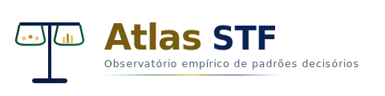
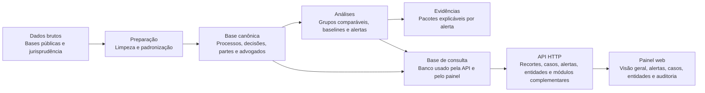

<p align="center">
  
</p>

<p align="center">
  <strong>Observatório empírico e auditável de padrões decisórios do Supremo Tribunal Federal</strong>
</p>

<p align="center">
  Camada analítica em Python + API FastAPI + dashboard Next.js sobre artefatos materializados e rastreáveis.
</p>

<p align="center">
  <a href="https://atlasstf.com.br/"></a>
  <a href="https://github.com/vittoroliveira-dev/atlas-stf/actions"></a>
  <a href="https://github.com/vittoroliveira-dev/atlas-stf/blob/main/LICENSE"></a>
  
  
  
  
  
  
  
  <a href="https://github.com/vittoroliveira-dev/atlas-stf/stargazers"></a>
</p>

<p align="center">
  <a href="https://atlasstf.com.br/">Website</a> ·
  <a href="#visão-geral">Visão Geral</a> ·
  <a href="#capacidades-atuais">Capacidades</a> ·
  <a href="#arquitetura">Arquitetura</a> ·
  <a href="#começando-localmente">Quickstart</a> ·
  <a href="#api-http">API</a> ·
  <a href="#documentação-e-governança">Documentação</a> ·
  <a href="#contribuindo">Contribuir</a>
</p>

---

## Visão Geral

> O Atlas STF não tenta provar favorecimento, parcialidade ou intenção. O projeto existe para localizar padrões, desvios, outliers e mudanças de comportamento decisório em subconjuntos comparáveis, com trilha de evidência auditável.

O repositório combina quatro frentes operacionais:

| Frente | Papel no sistema | Estado atual |
|---|---|---|
| Pipeline analítico | Ingestão, staging, curadoria, grupos comparáveis, baselines, alertas e bundles de evidência | Materializado |
| Serving layer | Banco de serving a partir de artefatos já gerados | Materializado |
| API HTTP | Endpoints de filtros, dashboard, alertas, casos, entidades, trilhas ministeriais, risco composto, análise temporal, velocidade decisória, redistribuição de relatoria, rede de advogados e auditoria | Materializado |
| Dashboard web | Interface auditável para navegação por recorte, alertas, casos, entidades, ministros, análise temporal, risco composto, velocidade decisória, redistribuição e rede de advogados | Materializado |

### O que este projeto responde

- Houve comportamento decisório atípico de um ministro em subconjuntos comparáveis?
- Certos advogados ou partes aparecem com frequência incomum em determinados recortes?
- Houve mudança relevante de padrão por período, classe ou colegialidade?
- Quais casos merecem aprofundamento documental externo posterior?

### O que este projeto não faz

- Não conclui favorecimento, corrupção ou parcialidade.
- Não infere intenção.
- Não trata desvio estatístico como prova.
- Não substitui leitura documental ou verificação externa.
- Não presume que o material público seja completo ou exaustivo.

## Escala Atual

| Indicador | Volume |
|---|---|
| Decisões organizadas | 411 mil+ |
| Processos conectados | 842 mil+ |
| Sinais de atenção | 187 mil+ |
| Relações priorizadas | 308 mil+ |
| Representantes (advogados) | 187 mil+ |
| Partes envolvidas | 447 mil+ |
| Vínculos com doações eleitorais | 234 mil+ |
| Conexões com sanções públicas | 5,9 mil+ |
| Registros temporais | 10,8 mil+ |
| Áreas de consulta no painel | 17 |

## Capacidades Atuais

### Estado operacional por subsistema

| Subsistema | Entrega principal | Evidência no repositório |
|---|---|---|
| `raw` e `staging` | Limpeza e padronização das exportações estruturadas | `src/atlas_stf/staging/`, `tests/staging/` |
| `core` | Domínio puro: identidade, parsers, regras, estatística, mapeamento de origem, TPU | `src/atlas_stf/core/`, `tests/core/` |
| `curated` | Entidades canônicas de processo, decisão, parte, advogado, assunto, biografia ministerial, movimentos, eventos de sessão, representação (advogados, escritórios, arestas, eventos) e agenda (agenda_event, agenda_coverage) | `src/atlas_stf/curated/`, `tests/curated/` |
| `analytics` | Grupos comparáveis, baseline, score, alertas, perfil de relator, auditoria de distribuição, análise temporal, counsel affinity, risco composto, velocidade decisória, mudança de relatoria, rede de advogados, linha do tempo processual, anomalia de pauta, identidade econômica, grupos econômicos, grafo de representação, recorrência, janelas temporais, rede amicus, clusters de escritórios, agenda exposure | `src/atlas_stf/analytics/`, `tests/analytics/` |
| `evidence` | Bundles técnicos por alerta | `src/atlas_stf/evidence/`, `tests/evidence/` |
| `agenda` | Fetcher de agenda ministerial da API GraphQL do STF, builder de eventos e analytics de exposição | `src/atlas_stf/agenda/`, `tests/agenda/` |
| `serving` | Banco de serving (38 tabelas SQLAlchemy) para API e UI | `src/atlas_stf/serving/` |
| `api` | Endpoints FastAPI (68) com filtros, páginas de detalhe e módulos analíticos | `src/atlas_stf/api/`, `tests/api/` |
| `stf_portal` | Extrator de linha do tempo processual do portal STF (httpx) | `src/atlas_stf/stf_portal/`, `tests/stf_portal/` |
| `cgu` | Dados CGU (CEIS/CNEP/Leniência) para cruzamento de sanções | `src/atlas_stf/cgu/`, `tests/cgu/` |
| `tse` | Doações eleitorais TSE (12 ciclos, 2002–2024) | `src/atlas_stf/tse/`, `tests/tse/` |
| `cvm` | Processos sancionadores CVM (mercado de capitais) | `src/atlas_stf/cvm/`, `tests/cvm/` |
| `rfb` | Dados abertos CNPJ da Receita Federal (Sócios, Empresas, Estabelecimentos e tabelas de domínio) para rede corporativa e grupos econômicos | `src/atlas_stf/rfb/`, `tests/rfb/` |
| `datajud` | Cliente API DataJud CNJ para contexto de tribunais de origem | `src/atlas_stf/datajud/`, `tests/datajud/` |
| `web` | Dashboard em Next.js 16 com páginas auditáveis | `web/src/app/`, `web/src/components/` |
| Governança | Regras, decisões, risco e auditoria | `docs/`, `governance/` |

### Fontes de dados integradas

| Fonte | Tipo | Cobertura |
|---|---|---|
| Acervo STF | Exportação CSV (~580 MB) | Processos, decisões, partes, advogados, assuntos |
| Jurisprudência STF | API + Playwright | Ementas e inteiro teor |
| CGU Portal da Transparência | API REST (httpx) | CEIS, CNEP, Leniência |
| TSE Doações Eleitorais | CSV público CDN | 12 ciclos (2002–2024), ~20,8M registros |
| CVM Processo Sancionador | ZIP/CSV dados abertos | Sanções do mercado de capitais |
| RFB Dados Abertos CNPJ | ZIP/CSV dados abertos | Sócios, Empresas e Estabelecimentos (~3,3M registros) |
| DataJud CNJ | API REST (httpx) | Agregações por tribunal de origem |
| PDPJ/CNJ TPU | API REST (gateway.cloud.pje.jus.br) | Tabelas Processuais Unificadas (847 classes, 957 movimentos, 5598 assuntos) |
| Portal STF | HTTP scraping (httpx) | Linha do tempo processual (andamentos, sessões, vistas) |
| STF GraphQL | API GraphQL (httpx) | Agenda ministerial (audiências, sessões, compromissos) |

## Arquitetura



### Princípios arquiteturais

- Separar análise determinística da leitura narrativa.
- Exigir grupo comparável antes de qualquer alerta.
- Manter rastreabilidade até o processo e o evento decisório.
- Expor na interface apenas artefatos já materializados.
- Permitir evolução da camada textual sem reescrever a base estatística.

### Stack

| Camada | Tecnologia |
|---|---|
| Backend analítico | Python 3.14+, pandas 3, scikit-learn, scipy |
| API | FastAPI + SQLAlchemy 2.x |
| Serving database | SQLite (38 tabelas) |
| Frontend | Next.js 16 + React 19 + TypeScript + Tailwind 4 + Recharts |
| Qualidade | pytest (83%), ruff, pyright, ESLint 10, vulture |
| Infra | Docker, GitHub Actions, uv |

### Configuração operacional canônica

- O arquivo canônico do serving DB é `data/serving/atlas_stf.db`.
- A URL canônica é `sqlite+pysqlite:///data/serving/atlas_stf.db`.
- `ATLAS_STF_DATABASE_URL` deve apontar para essa URL em execução local e no `docker-compose`.
- O serving DB é reconstruído a partir de `data/curated/` e `data/analytics/`; ele não é a fonte primária.

## Instalação via Pacote

O Atlas STF é distribuído como pacote Python via [GitHub Packages](https://github.com/vittoroliveira-dev/atlas-stf/packages).

```bash
pip install atlas-stf \
  --index-url https://pypi.pkg.github.com/vittoroliveira-dev/atlas-stf/simple/
```

> **Nota:** o registro GitHub Packages requer autenticação. Configure um [Personal Access Token](https://docs.github.com/en/packages/working-with-a-github-packages-registry/working-with-the-apache-maven-registry#authenticating-with-a-personal-access-token) com permissão `read:packages` e use-o como senha no `pip`:
>
> ```bash
> pip install atlas-stf \
>   --index-url https://<USUARIO>:<TOKEN>@pypi.pkg.github.com/vittoroliveira-dev/atlas-stf/simple/
> ```

Após a instalação, a CLI fica disponível:

```bash
atlas-stf --help
```

## Começando Localmente

### Pré-requisitos

- Python 3.14+
- `uv`
- Node.js 24+ (LTS, pinado via `.nvmrc`)
- `npm`

### 1. Instalação

```bash
git clone https://github.com/vittoroliveira-dev/atlas-stf.git
cd atlas-stf
uv sync
cd web && npm install && cd ..
```

### 2. Verificação rápida dos artefatos

Antes de subir a API, confirme que os artefatos derivados já existem:

```bash
test -f data/curated/process.jsonl
test -f data/analytics/outlier_alert.jsonl
```

Se eles não existirem, materialize o pipeline antes do serving build.

### 3. Pipeline local

```bash
# Tudo de uma vez (scrape → staging → curate → analytics → external → evidence → serving)
make pipeline

# Ou por etapas:
make scrape          # Baixa decisões e acórdãos da API do STF
make staging         # Limpeza e padronização dos CSVs brutos
make curate          # Curadoria de entidades canônicas
make analytics       # Grupos, baselines, alertas e módulos analíticos
make cgu             # Sanções CGU (CEIS/CNEP/Leniência)
make tse             # Doações eleitorais TSE
make cvm             # Sanções CVM
make rfb             # Rede corporativa RFB
make agenda           # Agenda ministerial (fetch + build + exposure)
make stf-portal      # Linha do tempo do portal STF
make evidence        # Bundles de evidência
make serving-build   # Materializa banco SQLite para API
```

### 4. Serving database + API

```bash
# Materializa ou recria o banco de serving canônico
uv run atlas-stf serving build --database-url "sqlite+pysqlite:///data/serving/atlas_stf.db"

# Sobe a API
ATLAS_STF_DATABASE_URL="sqlite+pysqlite:///data/serving/atlas_stf.db" \
uv run atlas-stf api serve --host 127.0.0.1 --port 8000
```

Ou, via `make`:

```bash
make serving-build
make serve-api
```

### 5. Dashboard web

Em outro terminal:

```bash
cd web
ATLAS_STF_API_BASE_URL="http://127.0.0.1:8000" npm run dev
```

Ou:

```bash
make web-dev
```

### 6. Docker Compose

O `docker-compose` canônico sobe a API em `:8000` e reconstrói automaticamente o serving DB canônico a partir de `./data` antes do startup.

```bash
docker compose up --build
```

Pré-condição: `data/curated/` e `data/analytics/` já precisam estar materializados no host.

## Páginas do Dashboard

| Caminho | Papel |
|---|---|
| `/` | Visão geral com métricas do período |
| `/ministros` | Ranking comparativo de ministros |
| `/ministros/[minister]` | Perfil analítico individual |
| `/alertas` | Lista paginada de alertas |
| `/caso` | Busca de casos |
| `/caso/[id]` | Detalhe do caso com trilha de evidência |
| `/advogados` | Ranking de advogados |
| `/advogados/[id]` | Perfil do advogado com correlações |
| `/partes` | Ranking de partes |
| `/partes/[id]` | Perfil da parte com correlações |
| `/sancoes` | Cruzamento com sanções (CEIS/CNEP/CVM) |
| `/doacoes` | Cruzamento com doações eleitorais (TSE) |
| `/vinculos` | Rede corporativa (RFB) |
| `/afinidade` | Afinidade ministro-advogado |
| `/convergencia` | Risco composto (múltiplos sinais) |
| `/temporal` | Análise temporal de padrões |
| `/origem` | Contexto de tribunais de origem (DataJud) |
| `/velocidade` | Anomalias de tempo de tramitação (fura-fila/parado) |
| `/redistribuicao` | Mudanças de relatoria e resultado pós-redistribuição |
| `/rede-advogados` | Clusters de advogados que compartilham clientes |
| `/agenda` | Agenda ministerial e exposição temporal |
| `/agenda/ministro/[slug]` | Detalhe de agenda por ministro |
| `/auditoria` | Auditoria de distribuição por relatoria |

## Fluxo de Trabalho da CLI

| Etapa | Comando-base |
|---|---|
| Manifesto de dados brutos | `uv run atlas-stf manifest raw` |
| Staging | `uv run atlas-stf stage` |
| Profiling | `uv run atlas-stf profile staging` |
| Validação | `uv run atlas-stf validate staging` |
| Auditoria | `uv run atlas-stf audit stage` / `curated` / `analytics` |
| Curadoria | `uv run atlas-stf curate ...` |
| Scraper de jurisprudência | `make scrape` (decisões + acórdãos) |
| CGU (CEIS/CNEP/Leniência) | `uv run atlas-stf cgu fetch` / `build-matches` |
| TSE (doações eleitorais) | `uv run atlas-stf tse fetch` / `build-matches` |
| CVM (sanções mercado) | `uv run atlas-stf cvm fetch` / `build-matches` |
| RFB (quadro societário) | `uv run atlas-stf rfb fetch` / `build-groups` / `build-network` |
| Compound Risk | `uv run atlas-stf analytics compound-risk` |
| Temporal Analysis | `uv run atlas-stf analytics build-temporal-analysis` |
| Minister Flow | `uv run atlas-stf analytics minister-flow` |
| Decision Velocity | `uv run atlas-stf analytics decision-velocity` |
| Rapporteur Change | `uv run atlas-stf analytics rapporteur-change` |
| Counsel Network | `uv run atlas-stf analytics counsel-network` |
| Procedural Timeline | `uv run atlas-stf analytics procedural-timeline` |
| Pauta Anomaly | `uv run atlas-stf analytics pauta-anomaly` |
| Representation Graph | `uv run atlas-stf analytics representation-graph` |
| Representation Recurrence | `uv run atlas-stf analytics representation-recurrence` |
| Representation Windows | `uv run atlas-stf analytics representation-windows` |
| Amicus Network | `uv run atlas-stf analytics amicus-network` |
| Firm Cluster | `uv run atlas-stf analytics firm-cluster` |
| Agenda Fetch | `uv run atlas-stf agenda fetch` |
| Agenda Build Events | `uv run atlas-stf agenda build-events` |
| Agenda Exposure | `uv run atlas-stf analytics agenda-exposure` |
| Curadoria de representação | `uv run atlas-stf curate representation` |
| Validação OAB | `uv run atlas-stf oab validate --provider null` |
| Extração de documentos | `uv run atlas-stf doc-extract run` |
| STF Portal | `uv run atlas-stf stf-portal fetch` |
| Analytics (todos) | `uv run atlas-stf analytics ...` |
| Evidence | `uv run atlas-stf evidence ...` |
| Serving | `uv run atlas-stf serving build ...` |
| API | `uv run atlas-stf api serve ...` |

## API HTTP

### Endpoints principais (68)

<details>
<summary>Expandir lista completa de endpoints</summary>

| Endpoint | Finalidade |
|---|---|
| `GET /health` | Sanidade da API e backend do banco |
| `GET /filters/options` | Opções e filtro aplicado |
| `GET /dashboard` | Snapshot principal do dashboard |
| `GET /ministers/{minister}/flow` | Fluxo ministerial por recorte |
| `GET /ministers/{minister}/profile` | Perfil analítico agregado do ministro |
| `GET /ministers/{minister}/sequential` | Indicadores sequenciais agregados do ministro |
| `GET /ministers/{minister}/bio` | Biografia resumida do ministro |
| `GET /alerts` | Lista paginada de alertas |
| `GET /alerts/{alert_id}` | Detalhe de alerta |
| `GET /cases` | Lista paginada de casos |
| `GET /cases/{decision_event_id}` | Detalhe de caso no recorte filtrado atual |
| `GET /cases/{decision_event_id}/related-alerts` | Alertas relacionados ao caso |
| `GET /counsels` e `/counsels/{counsel_id}` | Índice e detalhe de advogados |
| `GET /counsels/{counsel_id}/ministers` | Correlação do advogado com ministros |
| `GET /ministers/{minister}/counsels` | Advogados correlacionados a um ministro |
| `GET /parties` e `/parties/{party_id}` | Índice e detalhe de partes |
| `GET /parties/{party_id}/ministers` | Correlação da parte com ministros |
| `GET /ministers/{minister}/parties` | Partes correlacionadas a um ministro |
| `GET /audit/assignment` | Auditoria de distribuição por relatoria |
| `GET /origin-context` e `/origin-context/{state}` | Contexto de tribunais de origem (DataJud) |
| `GET /sources/audit` | Auditoria das fontes materializadas |
| `GET /sanctions` | Cruzamentos com sanções (CEIS/CNEP/CVM/Leniência) |
| `GET /sanctions/red-flags` | Red flags de sanções |
| `GET /parties/{party_id}/sanctions` | Sanções da parte |
| `GET /counsels/{counsel_id}/sanction-profile` | Perfil de sanções do advogado |
| `GET /donations` | Cruzamentos com doações eleitorais (TSE) |
| `GET /donations/red-flags` | Red flags de doações |
| `GET /parties/{party_id}/donations` | Doações da parte |
| `GET /counsels/{counsel_id}/donation-profile` | Perfil de doações do advogado |
| `GET /corporate-network` | Vínculos societários (RFB) |
| `GET /corporate-network/red-flags` | Red flags de rede corporativa |
| `GET /ministers/{minister}/corporate-conflicts` | Conflitos corporativos do ministro |
| `GET /counsel-affinity` | Afinidades ministro-advogado |
| `GET /counsel-affinity/red-flags` | Red flags de afinidade |
| `GET /ministers/{minister}/counsel-affinity` | Afinidades do ministro |
| `GET /counsels/{counsel_id}/minister-affinity` | Afinidades do advogado |
| `GET /compound-risk` | Índice de risco composto |
| `GET /compound-risk/red-flags` | Red flags de risco composto |
| `GET /compound-risk/heatmap` | Heatmap de risco por ministro |
| `GET /temporal-analysis` | Visão geral da análise temporal |
| `GET /temporal-analysis/{minister}` | Análise temporal por ministro |
| `GET /decision-velocity` | Lista paginada de velocidade decisória |
| `GET /decision-velocity/flags` | Anomalias de velocidade (fura-fila/parado) |
| `GET /rapporteur-change` | Lista paginada de mudanças de relatoria |
| `GET /rapporteur-change/red-flags` | Red flags de redistribuição |
| `GET /counsel-network` | Clusters de rede de advogados |
| `GET /counsel-network/red-flags` | Red flags de rede de advogados |
| `GET /caso/{process_id}/timeline` | Linha do tempo processual (movimentos) |
| `GET /caso/{process_id}/sessions` | Eventos de sessão do caso |
| `GET /economic-groups` | Grupos econômicos (lista paginada com filtros) |
| `GET /economic-groups/{group_id}` | Detalhe do grupo econômico |
| `GET /agenda/events` | Lista paginada de eventos de agenda ministerial |
| `GET /agenda/events/{event_id}` | Detalhe de evento de agenda |
| `GET /agenda/coverage` | Cobertura de agenda por ministro |
| `GET /agenda/exposure` | Scoring de proximidade temporal agenda-decisão |
| `GET /agenda/ministers/{slug}` | Agenda detalhada de um ministro |
| `GET /agenda/summary` | Resumo geral do módulo de agenda |

</details>

### Variáveis de ambiente

| Variável | Uso |
|---|---|
| `ATLAS_STF_DATABASE_URL` | Banco usado pela API |
| `ATLAS_STF_API_BASE_URL` | Base URL consumida pelo frontend |
| `ATLAS_STF_SCRAPER_IGNORE_HTTPS_ERRORS` | Ignora TLS do STF no scraper (`true` — já configurado no `make scrape`) |

## Estrutura do Repositório

```text
atlas-stf/
├── src/atlas_stf/
│   ├── core/             # Domínio puro (identidade, parsers, regras, stats, TPU)
│   ├── cli/              # CLI unificada do projeto
│   ├── staging/          # Limpeza e normalização
│   ├── scraper/          # Coleta de jurisprudência
│   ├── curated/          # Entidades canônicas
│   ├── analytics/        # Grupos, baselines, score, alertas, cruzamentos e risco
│   ├── evidence/         # Bundles de evidência
│   ├── stf_portal/       # Extrator de linha do tempo do portal STF
│   ├── agenda/           # Agenda ministerial STF (GraphQL fetcher + builder + analytics)
│   ├── serving/          # Banco de serving (38 tabelas SQLAlchemy)
│   ├── api/              # FastAPI (68 endpoints)
│   ├── cgu/              # CGU CEIS/CNEP/Leniência (httpx)
│   ├── tse/              # TSE doações eleitorais (CSV)
│   ├── cvm/              # CVM processos sancionadores (CSV)
│   ├── rfb/              # RFB dados abertos CNPJ (CSV)
│   ├── datajud/          # DataJud CNJ (httpx)
│   ├── oab/              # Validação OAB CNA/CNSA
│   └── doc_extractor/    # Extração seletiva de PDFs
├── web/                  # Dashboard Next.js 16 + React 19 + TypeScript
│   ├── src/app/          # 21 páginas (App Router, async Server Components)
│   ├── src/components/   # 35+ componentes
│   └── src/lib/          # 18+ módulos (API client, types, mappers)
├── tests/                # 100+ arquivos, 998 testes (mirror da src/)
├── docs/                 # Documentação metodológica (11 documentos)
├── governance/           # Regras, decisões, auditoria e risco
├── schemas/              # Contratos JSON das entidades
├── scripts/              # Scripts utilitários
├── assets/               # Identidade visual do projeto
├── .github/workflows/    # CI (ruff + pyright + pytest + ESLint + tsc)
├── Dockerfile            # Build multi-stage com uv + uvicorn
└── docker-compose.yml    # API containerizada
```

## Qualidade e CI

```bash
# Lint e typecheck (Python)
uv run ruff check src/ tests/
uv run pyright src/

# Testes (998, 83% cobertura mínima)
uv run pytest

# Lint e typecheck (Frontend)
cd web && npm run lint && npm run typecheck

# Todos de uma vez
make check && make test
```

O pipeline de CI roda em cada push/PR para `main`:
- **Python**: ruff lint + pyright + pytest com cobertura
- **Frontend**: ESLint + TypeScript check + build

## Estratégia de Evolução do Serving DB

- O serving DB é um artefato derivado, não a fonte primária de verdade.
- A estratégia atual é `descartável com invalidação automática`.
- O comando `uv run atlas-stf serving build ...` grava metadado interno de schema.
- Se o arquivo existente estiver sem esse metadado ou com fingerprint incompatível, ele é recriado.
- Não há migração incremental formal do serving DB nesta fase do projeto.

## Documentação e Governança

### Documentos centrais

| Documento | Papel |
|---|---|
| [Visão Geral](docs/00-visao-geral.md) | Definição institucional e estado atual |
| [Objetivos e Escopo](docs/01-objetivos-e-escopo.md) | Limites e entregas |
| [Fontes de Dados](docs/02-fontes-de-dados.md) | Fontes e cobertura observada |
| [Modelo de Dados](docs/03-modelo-de-dados.md) | Entidades e vínculos |
| [Metodologia Analítica](docs/04-metodologia-analitica.md) | Regras de inferência e alertas |
| [Casos Comparáveis](docs/05-definicao-de-casos-comparaveis.md) | Definição de grupos comparáveis |
| [Métricas e Avaliação](docs/06-metricas-e-avaliacao.md) | Qualidade e utilidade |
| [Riscos e Limitações](docs/07-riscos-e-limitacoes.md) | Salvaguardas metodológicas |
| [Governança](docs/08-governanca-e-auditoria.md) | Trilha de auditoria |
| [Roadmap](docs/09-roadmap.md) | Fases concluídas e próximas frentes |
| [Glossário](docs/10-glossario.md) | Termos e definições |

### Regras permanentes do projeto

- Linguagem neutra e metodológica.
- Separação entre fato, hipótese e inferência.
- Marcação de `INCERTO` quando a prova não existir.
- Rastreabilidade até a origem.
- Nenhum arquivo de código deve ultrapassar 500 linhas sem justificativa.

## Status Atual e Lacunas Conhecidas

### Já materializado

- Pipeline determinístico até alertas e bundles.
- Banco de serving para consumo de produto.
- API HTTP com filtros e detalhes de entidades, origem, sanções, doações, vínculos, afinidade, velocidade decisória, redistribuição de relatoria e rede de advogados.
- Dashboard navegável por recortes, alertas, casos, entidades, análise temporal, risco composto, velocidade decisória, redistribuição, rede de advogados e módulos complementares.
- Cruzamento com 7 fontes externas (CGU, TSE, CVM, RFB, DataJud, Jurisprudência, DJe).
- Governança explícita do projeto.

### Ainda em evolução

- Aprofundamento jurídico-textual posterior.
- Comparação argumentativa de amostra.
- Análise derivada opcional por IA sobre bundles.

### Snapshot materializado no workspace

Os artefatos atualmente presentes descrevem o seguinte snapshot:

| Artefato | Volume | Data |
|---|---|---|
| Grupos comparáveis | 5.153 (1.463 válidos) | 2026-03-07 |
| Baselines | 1.463 (87.964 eventos) | 2026-03-07 |
| Alertas | 487 (462 atipicidade, 25 inconclusivo) | 2026-03-07 |
| Sanction matches | 1.854 | 2026-03-08 |
| Donation matches | 11.972 | 2026-03-08 |
| Counsel affinity | 20.858 pares | 2026-03-08 |
| Corporate network | 12 vínculos | 2026-03-09 |
| Decision velocity | 403.135 (18.751 fura-fila, 20.406 parados) | 2026-03-13 |
| Rapporteur change | 311 mudanças (79 red flags) | 2026-03-13 |
| Counsel network clusters | 8.028 clusters (124.190 advogados, 11 red flags) | 2026-03-13 |

Esses números descrevem o snapshot derivado atualmente versionado no workspace. Eles não demonstram completude do universo do STF.

## Contribuindo

Contribuições são bem-vindas, desde que mantenham o rigor metodológico do projeto.

Antes de abrir PR:

```bash
uv run pytest
uv run ruff check src/ tests/
uv run pyright src/
cd web && npm run lint && npm run typecheck
```

Leituras obrigatórias:

- [CONTRIBUTING.md](CONTRIBUTING.md)
- [docs/08-governanca-e-auditoria.md](docs/08-governanca-e-auditoria.md)
- [governance/decision-log.md](governance/decision-log.md)

## Segurança

Problemas de segurança, exposição indevida de dados ou falhas que comprometam integridade e rastreabilidade devem seguir a política em [SECURITY.md](SECURITY.md).

## Licença

Distribuído sob a licença [PolyForm Noncommercial 1.0.0](LICENSE). Uso livre para fins não-comerciais — pesquisa, estudo, jornalismo, auditoria cívica e uso governamental são expressamente permitidos.

---

<p align="center">
  <sub>Projeto source-available de fiscalização cívica com base empírica — dados públicos, cruzamentos auditáveis, leitura orientada por evidências.</sub>
</p>
